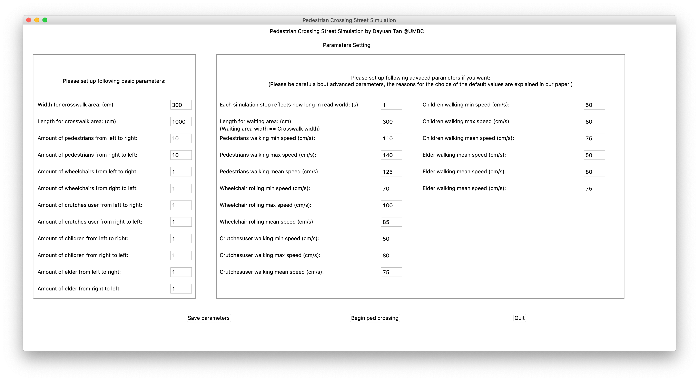
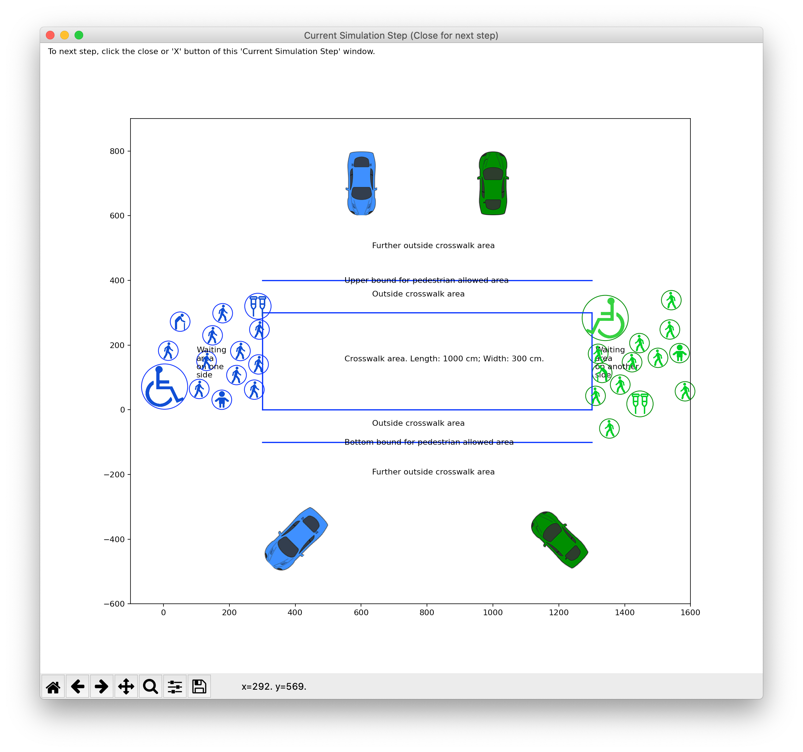
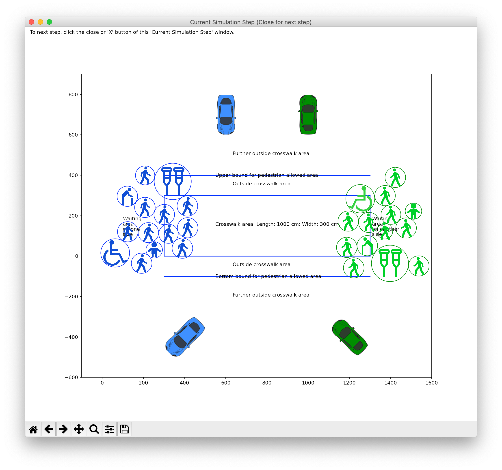
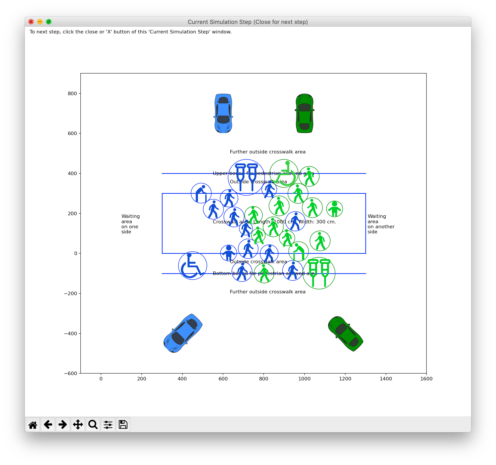
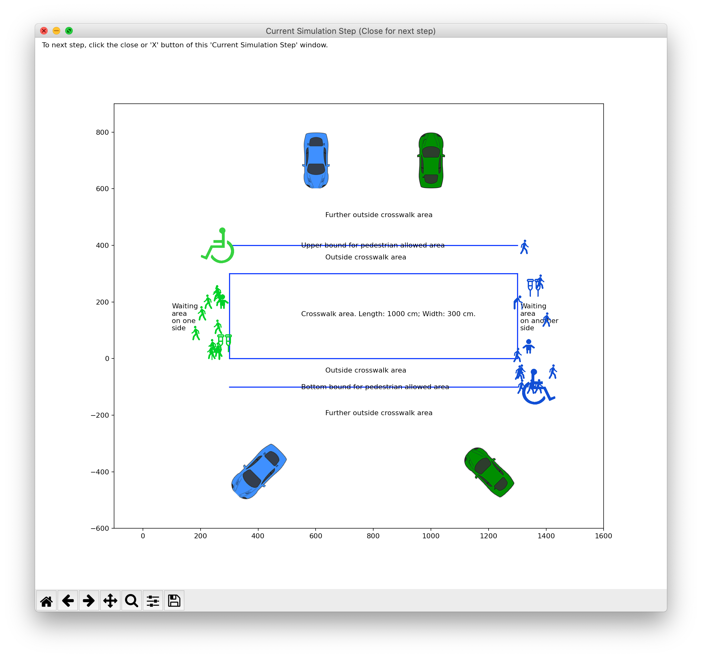

# Customized Pedestrians Road Crossing Simulator (PCS)

This is a open-source simulator to simulate the progress of pedestrians' crossing street via crosswalks. It calculates how long a group of pedestrians needs to cross the street, which can be used for future research.

## Citation

If you find any part of this repo helps your work, or your use any part of this repo, please cite our paper, which is a huge support for our research work.

## License
Please note this open-source repo uses GNU General Public License v3.0. 

## How to run

### Use backend API only:


Please checkout our example in [backend_example.py](backend_example.py).
Run the example:
```
python3 backend_example.py
```
**You can import this whole "PCS" directory in your code to use it, as what this above example did.**


### Use GUI only:
Just run:
```
python3 DayuanTanPCS/gui_start.py
```
Then you will begin with parameters configration page, like this:


Change parameters as you want and then click "Save parameters" button to save them.

Then click "Begin ped crossing" button to let pedestrians to start crossing the street. It will open a new window which is the pedestrian initial positions page:


You can see different types of pedestrians take up different occupied space. And because they are standing and waiting at this moment, the space/circle are smaller than when they are walking in later steps.

Then click the "close" or "X" button on the top left (if Mac OS) or on the top right (if Windows OS) to go to next step. Wait a few seconds if your pedestrian amount is a large number, until you see pedestrians (cycles) move. The below screenshot shows one intermediate simulation step:




You can  see pedestrians in crowded areas have smaller circles because they have to slow down. Obviously people take up smaller occupied space when they have smaller walking speed.

When a pedestrian passed the street, her or his circle will disappear:



When it finishes the last step it will show you how long these pedestrians used to cross. Then click 'Quit' button to quit this simulator.

## Log system
We designed a log system to print different levels logs for debugging. You can modify the elements of the list ```self.log_keywords = ["core"]``` in [DayuanTanPCS/global_params/global_params.py](DayuanTanPCS/global_params/global_params.py) to print different levels of logs. 

Hint: if you print too much logs, it's better to stream into a file instead of to standard output. For example, ```python3  backend_example.py > log.today_date.md```


## Acknowledgement:
Car cartoon images credit to http://clipart-library.com/clipart/1828016.htm.
