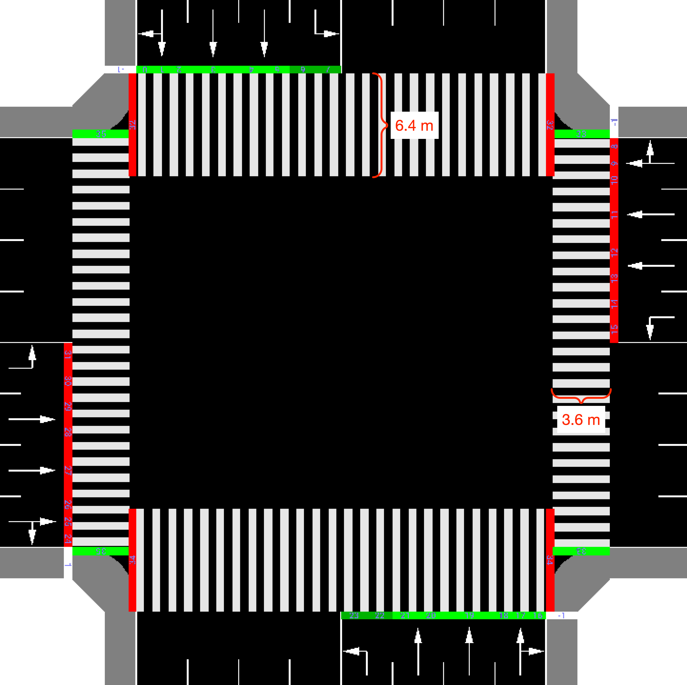

# Raw Data

Our raw data (videos) are shared via [googld drive](https://drive.google.com/drive/folders/1IopGON6Mu59UCQeo8boPcuseAtXAf8Au?usp=sharing).

# Intersection information

The intersection we observed is the intersection of Ming Guang Road and Feng Cheng No.9 Road in Xi An City, Shaan Xi Province, China. 

The speed limit of incoming and outgoing edges is 60 km/h or 37.2823 miles/h or 16.6667 meter/s.

The length of the crosswalk on North and South sides is (40.85+48.93)/2 = 47.69 m. West and East side is 43.62 m. 

The width of the crosswalk on North and South sides is 6.4 m. West and East is 3.6 m.

It looks like this:

## Traffic lights period

The traffic lights schedule in this intersection has a period of 140 seconds as one cycle. In each cycle there are four phases, which are 84s, 3s, 50s and 3s. They are shown in below figures:

## North direction

The video of the intersection is took at the east-south corner. So in the video, right hand is North side in real world. 

## Vehicle Types

We only category vehicles into small vehicles and big vehicles. 
- Small vehicles include all 4 tires cars, like sedan, hatchback, wagon, van, SUV, MPV and so on.
- Big vehicles include all others which has bigger size than small vehicles, like bus, coach, truck, semitrailer, trailer and so on. 

## Intersection 2021-08-26 Thursday Around 7pm, Total 20 mins

We recorded this  video at around 7pm, which is traffic peak time, on 8/26/2021. This video has 20  mins long.

There are 8 periods/cycles during this 20 mins. They are (video timstamp):

||||||
|-|-|-|-|-|
| Cycle 1: | phase 1 00:52-02:16,  | phase 2	02:16-02:19, | phase 3	02:19-03:09, | phase 4	03:09-03:12	|
| Cycle 2: | phase 1 03:12-04:36,  | phase 2	04:36-04:39, | phase 3	04:39-05:29, | phase 4	05:29-05:32	|
| Cycle 3: | phase 1 05:32-06:56,  | phase 2	06:56-06:59, | phase 3	06:59-07:49, | phase 4	07:49-07:52	|
| Cycle 4: | phase 1 07:52-09:16,  | phase 2	09:16-09:19, | phase 3	09:19-10:09, | phase 4	10:09-10:12	|
| Cycle 5: | phase 1 10:12-11:36,  | phase 2	11:36-11:39, | phase 3	11:39-12:29, | phase 4	12:29-12:32	|
| Cycle 6: | phase 1 12:32-13:56,  | phase 2	13:56-13:59, | phase 3	13:59-14:49, | phase 4	14:49-14:52	|
| Cycle 7: | phase 1 14:52-16:16,  | phase 2	16:16-16:19, | phase 3	16:19-17:09, | phase 4	17:09-17:12	|
| Cycle 8: | phase 1 17:12-18:36,  | phase 2	18:36-18:39, | phase 3	18:39-19:29, | phase 4	19:29-19:32 |
||

## Traffic demands (Pedestrians and Vehicles count)

Passed Pedestrians and Vehicles counts of each phase of each cycle are counted. All are recorded in [this excel file: 0826_7pm_vehicles_N_ped_count_colored.xlsx](0826_7pm_vehicles_N_ped_count_colored.xlsx). 
- If there is only samll vehicles, the corresponding record cell has one number. Like cell B7=8, B8=4 means there are 8 small vehicles and 4 small vehicles perspectively, no big vehicles.
- If there is big vehicles, no matter small vehicles or not, the format of the corresponding record cell is "count of small vehicles + count of big vehicles". Like B6=32+5, means there are 32 small vehicles and 5 big vehicles. Similarly U13=0+1 means there are 0 small vehicles and 1 big vehicles.
  

# Crosswalk information

We observed pedestrians passing crosswalk to collect pedestrians related information in order to validate our pedestrains road-crossing simulator (PCS). 

## crosswalk 1

The crosswalk is the north side crosswalk of the intersection between Wei Yang Road and Feng Cheng No. 7 Road in Xi An City, Shaan Xi Province, China. Its width is 3.6 m and length is 45.045 m. 

## Record time

We recorded two video at this crosswalk. They are around 2 pm, whcih is traffic low time, and around 7pm, which is traffic peak time, on 8/26/2021. 

We counted how many pedestrians passes the road using this  corsswalk and how long they tool to finish corssing. All are recorded in [this excel file: Crosswalk_count_v3.xlsx](Crosswalk_count_v3.xlsx). 

## crosswalk 2

The 2nd crosswalk is the west side corsswalk of the intersection. Record is [this excel file: Crosswalk_of_IntersectionWestSide_count_v3.xlsx](Crosswalk_of_IntersectionWestSide_count_v3.xlsx).

# Walking speed

We observed arbitrarily selected 30 pedestrians at the intersection and their speeds are recorded in [Crosswalk_speed_v2_30peds.xlsx](Crosswalk_speed_v2_30peds.xlsx).

The walking speeds follow the normal distribution N(1.2676, 0.09167).